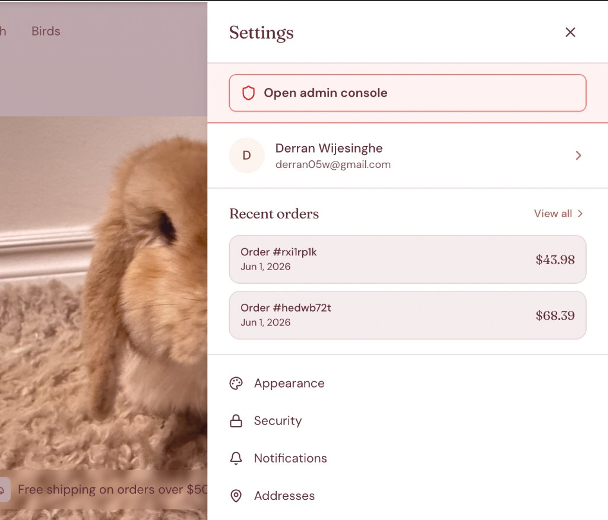
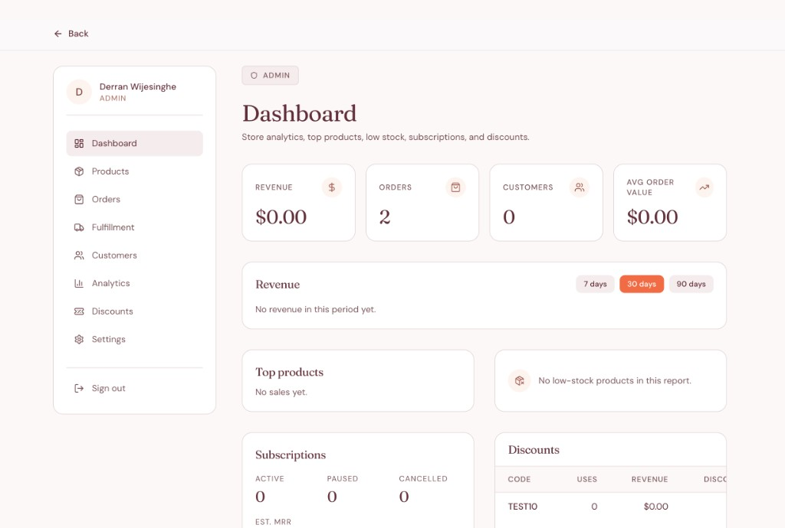
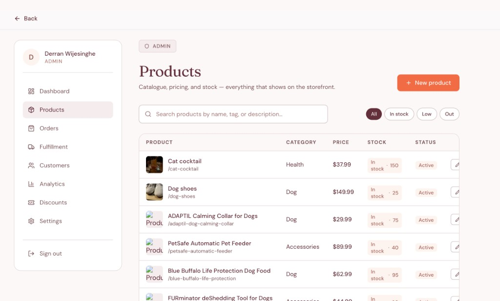
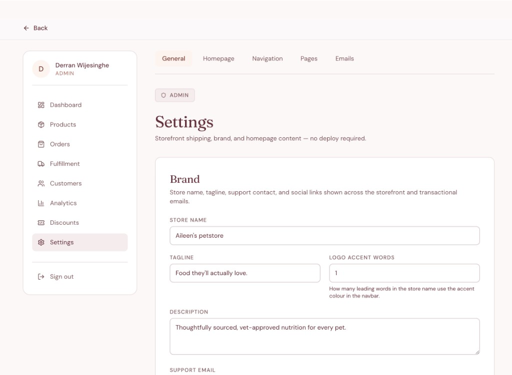
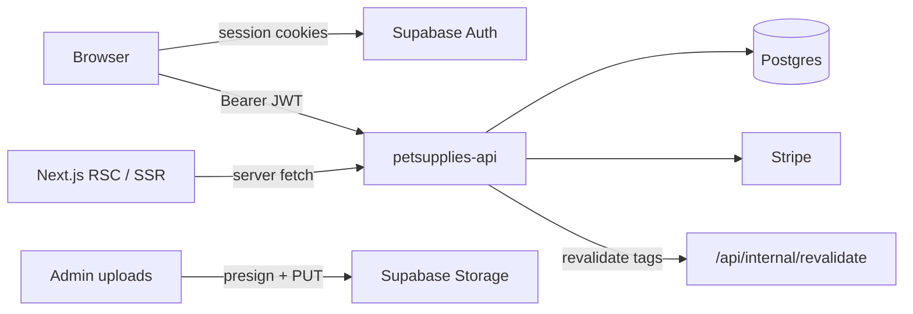

# Aileen's Petstore (petsupplies-web)

Hey — thanks for stopping by.

Could I build an ecommerce platform? And if so, how fast could I ship it using AI?

This started with a friend who wanted to start a business but only knew they needed a website. I took that and turned it into a real, fully built store — tailored to them, built to scale, and easy to run. The key piece is the **admin console**: they can manage everything themselves (products, orders, pricing, content, the homepage) without needing a software engineer down the line.

The bar was simple — **ship a product, not a demo.** A site you can browse, buy from, and run as a real business, with the fintech and platform habits I picked up at **BitGo** and past internships baked in (defense-in-depth auth, contract-first integration, graceful degradation).

What you're looking at is the **Next.js frontend**. The commerce backend lives in a sibling repo (`petsupplies-api`); together they form the full stack.

**Live demo:** [petsupplies-web.vercel.app](https://petsupplies-web.vercel.app/) — browse the storefront, cart, and checkout for yourself.

---

## Inside the admin console

The storefront speaks for itself in the [live demo](https://petsupplies-web.vercel.app/), but the admin side is gated — so here's a look at the part that lets a non-technical owner run the whole business.

**Owner-facing entry point.** The store owner opens the console straight from the storefront settings drawer — no separate login, no URL to remember.



**Dashboard.** Revenue, orders, customers, and average order value at a glance, plus top products, low-stock alerts, subscriptions, and discount performance.



**Products.** Full catalog management — pricing, stock, status, and search — with AI-assisted descriptions and image upload behind each product.



**Settings (no deploy required).** Brand, homepage, navigation, pages, and email templates are all editable in-app. Change the store name, tagline, or homepage content and it goes live without a developer or a redeploy.



---

## What's here

A production-style **e-commerce web app** for a pet supplies brand (currently branded **Aileen's petstore** — configurable via admin). It includes:

| Surface         | What you get                                                                                                             |
| --------------- | ------------------------------------------------------------------------------------------------------------------------ |
| **Storefront**  | Homepage, catalog with search/filters, product detail, cart, Stripe Checkout, CMS pages (About, FAQ, policies)           |
| **Account**     | Orders, wishlist, subscriptions, stock alerts, pet profiles, address book, settings hub                                  |
| **Admin**       | Dashboard analytics, products (with AI descriptions + image upload), orders, fulfillment, customers, discounts, site CMS |
| **Email pages** | Preview/action routes for transactional emails (order, cart recovery, stock, unsubscribe)                                |

The app is **deployed on Vercel** and talks to a **Railway-hosted API**, **Supabase** (auth + storage), and **Stripe** (Hosted Checkout).

---

## Architecture

This repo is deliberately **frontend-only**. Business logic, Postgres, webhooks, and presigned uploads live in **`petsupplies-api`**.



### Why split frontend and API?

- **Clear contracts** — The web app maps API shapes (snake_case, cents) to UI types in `lib/api/*` (see [`docs/api-contracts.md`](docs/api-contracts.md)).
- **Security layering** — Supabase JWT for identity; API enforces `User.role = ADMIN` for admin routes; middleware enforces `app_metadata.role === 'ADMIN'` before `/admin` renders.
- **Deploy flexibility** — Vercel for the UI, Railway for the API, without coupling release cycles.

### API routing (dev vs production)

| Context       | How requests reach the API                                                                                    |
| ------------- | ------------------------------------------------------------------------------------------------------------- |
| **Local dev** | Browser calls same-origin `/api-backend/*` → Next rewrite → `localhost:3001` (avoids CORS)                    |
| **Vercel**    | Browser calls `NEXT_PUBLIC_API_URL` directly (HTTPS Railway); API `FRONTEND_URL` must match the Vercel origin |

Server Components and middleware always call the API URL directly — no proxy.

Central fetch wrapper: [`lib/api/client.ts`](lib/api/client.ts) (`apiFetch`, `ApiError`, network vs HTTP errors).

### Caching & CMS

Public site content (`GET /site/*`) uses **ISR** (`revalidate: 300`) with cache tags (`site-settings`, `site-nav`, `site-pages`, etc.). When an admin saves settings, the API hits `POST /api/internal/revalidate` with a shared `INTERNAL_REVALIDATE_TOKEN` so pages refresh without a full redeploy.

If the API is down, the storefront **degrades gracefully** via fallbacks in `lib/site/fallbacks.ts` rather than hard-crashing.

### Streaming UI

Heavy pages use a **shell + Suspense + skeleton** pattern (homepage sections, product detail, admin tables). See [`docs/patterns/streaming-pages.md`](docs/patterns/streaming-pages.md).

---

## Tech stack

| Layer                 | Choice                                                             |
| --------------------- | ------------------------------------------------------------------ |
| Framework             | **Next.js 14** (App Router), React 18, TypeScript (strict)         |
| Styling               | **Tailwind CSS** + CSS variables (`app/globals.css`)               |
| Auth                  | **Supabase Auth** (`@supabase/ssr`) — email/password, Google OAuth |
| Data / commerce       | **petsupplies-api** over HTTP                                      |
| Payments              | **Stripe Hosted Checkout** (session from API → redirect)           |
| Client cart           | **Zustand** + `localStorage`, merged to server cart on login       |
| Server state (client) | **TanStack React Query**                                           |
| Forms                 | **React Hook Form** + **Zod**                                      |
| Admin charts          | **Recharts**                                                       |
| CMS markdown          | **react-markdown** + **rehype-sanitize**                           |
| Tests                 | **Vitest** + Testing Library, **Playwright** E2E                   |
| CI                    | GitHub Actions (lint, typecheck, unit, build, E2E)                 |
| Hosting               | **Vercel** (this repo) + **Railway** (API)                         |
| Dev environment       | Optional **Nix flake** + **direnv** (Node 20, pnpm)                |

---

## Features (by area)

### Storefront

- Homepage: hero, category strip, featured products, brand values
- Product catalog: search, sort, filters, pagination (`/products`)
- Product detail: gallery, nutrition accordion, related products, reviews, wishlist, Subscribe & Save, back-in-stock signup
- Cart drawer + `/cart` with discount codes and free-shipping progress
- Checkout (auth required): address, shipping rates, redirect to Stripe (`/checkout`, success/cancel routes)
- CMS pages from API markdown: `/about`, `/privacy`, `/terms`, `/shipping`, `/returns`, `/faq`, etc.
- Global search overlay, settings drawer (theme, shortcuts), light/dark theme with persistence

### Account (`/account/*`)

- Order history and order detail
- Wishlist
- Subscriptions (pause / resume / cancel)
- Back-in-stock notifications
- Pet profiles
- Address book
- Settings hub: profile, security, notifications, addresses, privacy, theme, help

### Admin (`/admin/*`)

Middleware + layout require **ADMIN** role. Nav includes:

- **Dashboard** — KPIs, revenue chart, top products, low stock, subscription/discount stats
- **Products** — CRUD, stock, streaming **AI product descriptions**, **presigned image upload** to Supabase
- **Orders** & **Fulfillment**
- **Customers** — list, detail, orders, subscriptions
- **Discounts** — promo codes
- **Settings** — brand/shipping, homepage (hero, featured, category strip), navigation, static pages, email templates

Admin access is documented in depth: [`docs/admin-access.md`](docs/admin-access.md).

### Email preview routes (`/email/*`)

Public, `noindex` pages for designing and testing transactional emails: order, cart recovery, back-in-stock, preferences, unsubscribe.

---

## Design choices I'm proud of

These come straight from fintech / platform engineering habits:

1. **Defense in depth for admin** — JWT role in middleware _and_ Postgres role on the API _and_ storage policies for legacy upload paths. Wrong API URL? `AdminAccessBanner` tells you.
2. **Tokens stay out of DIY storage** — API calls use Supabase session Bearer tokens per request; the app doesn't invent its own auth cookies for commerce.
3. **Safe redirects** — `lib/navigation/safe-return-path.ts` prevents open redirects after login.
4. **Honest API errors** — `apiFetch` distinguishes network failures (status 0) from HTTP errors; non-JSON 200s are caught.
5. **Guest → logged-in cart merge** — Local Zustand cart posts to `POST /cart/items` after sign-in so nothing is lost.
6. **Contract-first integration** — Field mappers (`lib/api/product-mapper.ts`, etc.) keep the UI stable when the API evolves.

---

## Project structure

```
app/
  (shop)/          # Storefront routes
  (auth)/          # Login, signup
  account/         # Customer hub
  admin/           # Owner console
  email/           # Email preview pages
  api/             # auth/callback, internal/revalidate
components/        # UI by domain (admin, cart, product, layout, …)
lib/
  api/             # API clients + mappers
  supabase/        # Auth clients, session helpers
  store/           # Zustand cart
  site/            # Fallbacks when API unavailable
hooks/             # React Query + auth hooks
docs/              # Contracts, deployment, admin access
tests/             # unit/ + e2e/
```

---

## Getting started

### Prerequisites

- **Node 20** and **pnpm**
- Running **`petsupplies-api`** on port `3001` (sibling repo)
- **Supabase** project (Auth + Storage for product images)
- **Stripe** test keys (publishable key in this repo; secrets in the API)

### Setup

```bash
cp .env.local.example .env.local
# Fill in Supabase, Stripe publishable key, API URL, revalidate token

pnpm install
pnpm dev
```

Open [http://localhost:3000](http://localhost:3000).

**Supabase redirect URL:** `http://localhost:3000/api/auth/callback`  
**API CORS:** set `FRONTEND_URL=http://localhost:3000` on the API.

Optional: `nix develop` or `direnv` (see `flake.nix`, `.envrc`) for reproducible Node/pnpm.

### Environment variables

| Variable                                    | Required             | Purpose                                                                                                                                                 |
| ------------------------------------------- | -------------------- | ------------------------------------------------------------------------------------------------------------------------------------------------------- |
| `NEXT_PUBLIC_SUPABASE_URL`                  | Yes                  | Supabase project URL                                                                                                                                    |
| `NEXT_PUBLIC_SUPABASE_ANON_KEY`             | Yes                  | Anon key                                                                                                                                                |
| `NEXT_PUBLIC_STRIPE_PUBLISHABLE_KEY`        | Yes                  | Stripe publishable key                                                                                                                                  |
| `NEXT_PUBLIC_API_URL`                       | Yes                  | API origin (no trailing slash)                                                                                                                          |
| `INTERNAL_REVALIDATE_TOKEN`                 | For CMS revalidation | Secures `POST /api/internal/revalidate` (must match API). Optional for basic browsing; required so admin CMS saves refresh ISR pages without a redeploy |
| `NEXT_PUBLIC_FREE_SHIPPING_THRESHOLD_CENTS` | No                   | Bootstrap default (`5000`); live value from `GET /site/settings`                                                                                        |

See [`.env.local.example`](.env.local.example) for admin image upload notes (presigned flow via API).

### Promote an admin user

Follow [`docs/admin-access.md`](docs/admin-access.md) — JWT `app_metadata.role` and API `User.role` must both be `ADMIN`.

### Static assets

Drop `public/images/hero-placeholder.jpg` for the homepage hero and product fallbacks (see [`public/images/README.md`](public/images/README.md)).

---

## Scripts

| Command                             | Description              |
| ----------------------------------- | ------------------------ |
| `pnpm dev`                          | Local dev server         |
| `pnpm build`                        | Production build         |
| `pnpm start`                        | Run production build     |
| `pnpm lint` / `pnpm lint:fix`       | ESLint                   |
| `pnpm format` / `pnpm format:check` | Prettier                 |
| `pnpm type-check`                   | `tsc --noEmit`           |
| `pnpm test:unit`                    | Vitest (once)            |
| `pnpm test`                         | Vitest watch             |
| `pnpm test:e2e`                     | Playwright               |
| `pnpm test:e2e:install`             | Install Chromium for E2E |

---

## Deployment

Full runbook: [`docs/deployment.md`](docs/deployment.md).

Short version:

- **Vercel** watches `main` → Production; every PR → Preview
- Set all `NEXT_PUBLIC_*` vars in Vercel (they are **inlined at build** — redeploy after changes)
- Wire **Railway** `FRONTEND_URL`, matching `INTERNAL_REVALIDATE_TOKEN`, and Supabase redirect URLs to your Vercel origin
- CI (`.github/workflows/ci.yml`) gates merges; it does not deploy

---

## Documentation index

| Doc                                                                    | Contents                                 |
| ---------------------------------------------------------------------- | ---------------------------------------- |
| [`docs/deployment.md`](docs/deployment.md)                             | Vercel + cross-service wiring            |
| [`docs/admin-access.md`](docs/admin-access.md)                         | Admin promotion & troubleshooting        |
| [`docs/admin-settings.md`](docs/admin-settings.md)                     | Self-serve storefront CMS & revalidation |
| [`docs/api-contracts.md`](docs/api-contracts.md)                       | API ↔ UI field mapping                   |
| [`docs/backend-api-routes.md`](docs/backend-api-routes.md)             | API route inventory                      |
| [`docs/patterns/streaming-pages.md`](docs/patterns/streaming-pages.md) | Suspense / skeleton pattern              |

---

## Related repos & services

- **`petsupplies-api`** — REST API, Prisma/Postgres, Stripe webhooks, cron, presigned uploads
- **Supabase** — Auth sessions, product image storage
- **Stripe** — Checkout sessions (created by API)
- **Vercel** — This frontend

---

## License

Private project. All rights reserved unless otherwise noted.
